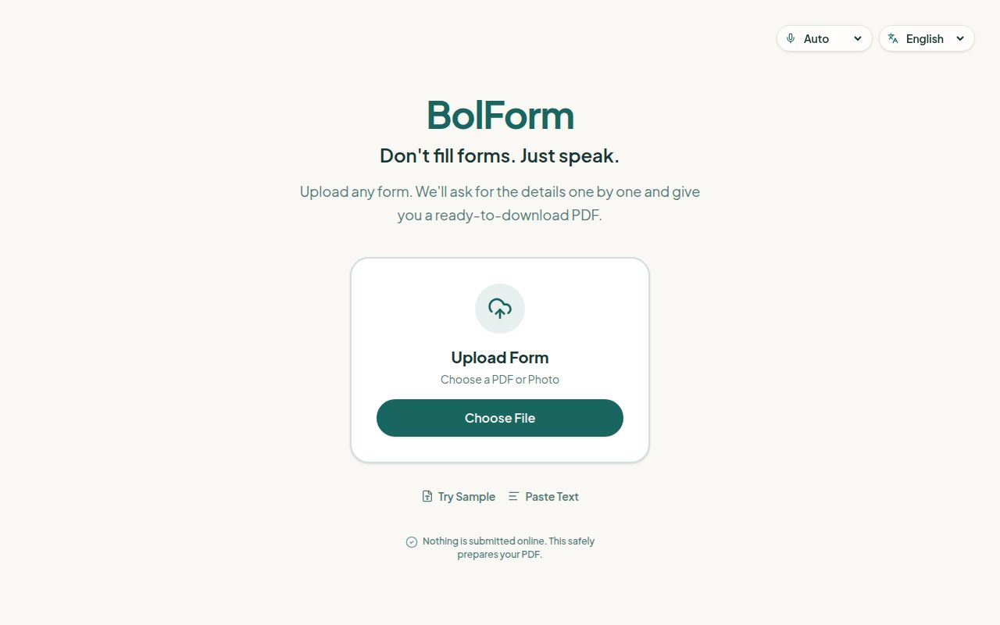

<h1 align="center">BolForm</h1>

<p align="center">
  <strong>Don't fill forms. Just speak.</strong><br>
  फ़ॉर्म भरने की झंझट नहीं। बस बोलें।
</p>

<p align="center">Turn forms into guided conversations in 11 languages used across India.</p>

<p align="center">
  <a href="https://bol-form-voice-form-assistant.replit.app"><strong>Try the live demo →</strong></a>
  &nbsp;·&nbsp;
  <a href="DEMO.md">Demo walkthrough</a>
  &nbsp;·&nbsp;
  <a href="docs/BUILD_STORY.md">Built with Replit Agent</a>
</p>

<p align="center">
  <a href="https://bol-form-voice-form-assistant.replit.app"></a>
  
  <a href="LICENSE"></a>
</p>

<p align="center">
  <a href="https://bol-form-voice-form-assistant.replit.app"></a>
</p>

## A familiar problem

A parent may know every answer on a school enquiry form and still struggle with its English labels. A volunteer may be comfortable speaking, but find typing difficult. BolForm turns that paperwork into one spoken question at a time.

Upload a PDF or photo, or paste the questions. Answer in your language, review the details, and download a PDF. **You choose how to speak; BolForm prepares answers in the form's language.**

## Try it in two minutes

No account or API key is needed to try the [hosted demo](https://bol-form-voice-form-assistant.replit.app).

1. Choose **Try Sample** → **Sahyog Learning Centre — Admission Enquiry**.
2. Leave **Speaking language** on **Auto**, choose **Start filling**, and allow the microphone when prompted.
3. Answer one question at a time: “अनन्या शर्मा”, then “सातवीं”. Watch the English form receive the name and class `7`.
4. Finish with fictional details, open **Review answers**, edit an answer, and **Download PDF**.

**A small moment to show off:** when asked for the phone number, try `12345`. BolForm asks for a complete 10-digit number instead of accepting it. You can also switch spoken languages mid-session while keeping the screen in English.

Prefer typing? Use the text-answer option. See the [full walkthrough and expected results](DEMO.md) for a repeatable demo.

## What makes it useful

| For the person filling the form | What BolForm does |
| --- | --- |
| “I understand this better in my language.” | Spoken questions and answers in 11 languages; screen language is a separate choice. |
| “My form needs English, but I speak Hindi.” | Transliterates names and places; translates other answers into the form's language. |
| “I don't know what to fill next.” | Asks for one missing required detail at a time. |
| “I said the wrong thing.” | Supports spoken corrections, Undo, and manual review before export. |
| “I have a different form.” | Accepts PDF, PNG, JPEG, and pasted text, alongside two fictional samples. |
| “I need something I can take away.” | Exports a filled original for supported uploaded PDF text fields, or a labelled response sheet. |

**Languages:** Hindi · English · Bengali · Gujarati · Kannada · Malayalam · Marathi · Odia · Punjabi · Tamil · Telugu.

Hindi and English interface text is authored directly; the other nine translations are bundled with an English fallback. Response sheets include Noto fonts for supported Indic scripts.

## Built with Replit Agent, refined through iteration

The repository records multiple rounds of product and engineering work with Replit Agent. Each round addressed a specific friction point:

| Iteration | Change you can inspect |
| --- | --- |
| Make the first action obvious | [Simplified the home screen and redesigned the voice orb](https://github.com/Hritikd/Bolform/commit/2dc8cb65d09089c30feacf8067417bbec81a734b). |
| Reduce pauses between answers | [Added direct handling of short answers, browser transcription, and streamed speech](https://github.com/Hritikd/Bolform/commit/6621be2e241081f71a37cd1af4efa039dbee1488). |
| Make the conversation more natural | [Improved Hindi questions, class-word matching, auto transcription, and failure recovery](https://github.com/Hritikd/Bolform/commit/ce49dd5ecf65d1584e9c52d2fe319c7ca9a546db). |

The subsequent [11-language update](https://github.com/Hritikd/Bolform/commit/0e4c5ace9047cb0c018630cd66abe5d9a91a13b6) added broader language handling, static interface translations, and Indic PDF fonts. The [build story](docs/BUILD_STORY.md) separates Agent-authored iterations from that later update and explains the tradeoffs.

## How it works

**Bring a form → answer aloud → review the details → download a PDF.**

The React interface handles recording and review. An Express API reads the form, validates answers, and generates the PDF. Sarvam AI provides speech recognition, spoken replies, language conversion, and document understanding.

Short, direct answers can follow a deterministic path without a conversation-model call. Longer answers and corrections use the model, with field IDs, select options, phone numbers, and email formats checked on the server. [Explore the architecture and API →](docs/DEVELOPMENT.md#architecture)

## Scope and data handling

- **Prototype scope:** documents up to 10 MB, intended for up to 3 pages and 25 fields; recordings up to 25 seconds.
- **Export:** scans, photos, pasted text, and built-in samples produce a labelled response sheet. Supported uploaded fillable PDFs can retain their original layout. Review the output before use.
- **You stay in control:** BolForm prepares a PDF. It does not submit forms, sign documents, handle payments, or guarantee institutional acceptance.
- **Processing:** the app uses browser and server memory rather than a user database. Audio, text, and documents may be sent to Sarvam AI; supported browsers can also provide speech recognition. Use fictional details for the demo.

## Run it yourself

The workspace targets **Replit / Linux x64**, with **Node.js 24** and **pnpm 10**. You'll need a server-side `SARVAM_API_KEY` from [Sarvam](https://dashboard.sarvam.ai/).

```bash
git clone https://github.com/Hritikd/Bolform.git
cd Bolform
pnpm install --frozen-lockfile
export SARVAM_API_KEY='your_key_here'
PORT=8080 pnpm --filter @workspace/api-server run dev
```

In a second terminal, from the same folder:

```bash
PORT=5173 BASE_PATH=/ API_PROXY_TARGET=http://localhost:8080 pnpm --filter @workspace/bolform run dev
```

Open [localhost:5173](http://localhost:5173). The existing dependency configuration excludes native packages for macOS and Windows; use a Linux x64 environment for this setup. See the [developer guide](docs/DEVELOPMENT.md) for configuration, verification, deployment, and troubleshooting.

## Explore further

- [Demo walkthrough](DEMO.md) — what to try, expected results, and the limits of existing verification.
- [Build story](docs/BUILD_STORY.md) — Replit Agent iterations with links to the actual changes.
- [Developer guide](docs/DEVELOPMENT.md) — architecture, API, setup, and contribution checks.
- [Report a bug](https://github.com/Hritikd/Bolform/issues) — include the browser, language, and steps using fictional data.

Created by [Hritik Datta](https://github.com/Hritikd). Released under the [MIT License](LICENSE). Built with Replit Agent and [Sarvam AI](https://www.sarvam.ai/), with PDF generation by [pdf-lib](https://pdf-lib.js.org/) and Indic fonts from [Noto](https://github.com/notofonts).
